# Programm
Ein Programm besteht aus einer Liste beliebig vieler Statements
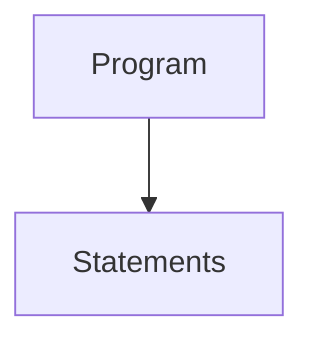

## Statement
Ein Statement kann 
 * ein Ausdruck, 
 * eine Zuweisung, 
 * eine Schleife, 
 * eine bedingten Anwesiung, 
 * eine Funktionsdefinition, 
 * eine Rückgabeanweisung,
 * eine Klassendefinition
 * oder das Keyword `pass`  
 
sein
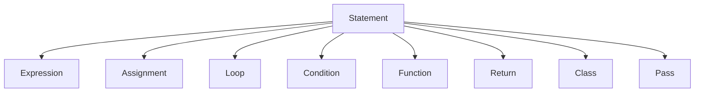

### Ausdruck
Ein Ausdruck kann
 * ein Funktionsaufruf
 * ein Identifier
 * ein Wert
 * eine Berechnung
 * ein Vergleich
 * ein bool'sche Negation
 * oder eine bool'sche Verknüpfung  
 
sein
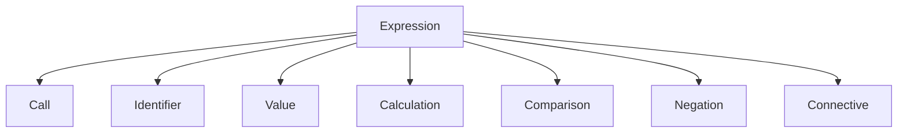

#### Funktionsaufruf
Ein Funktionsaufruf besteht aus dem Namen der aufzurufenden Funktion und den Parametern, welche wiederum aus einer Liste von Ausdrücke besteht
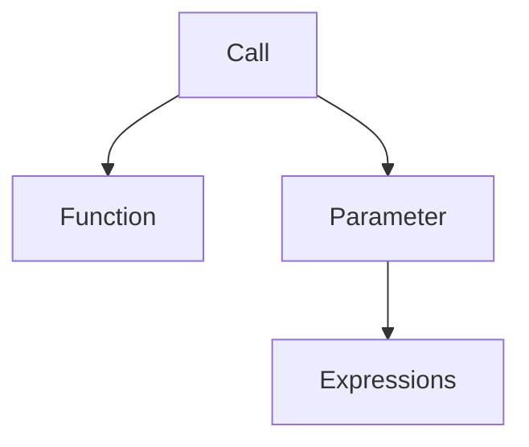

#### Wert
Ein Wert kann ein Integer-, String- oder Booleanliteral sein
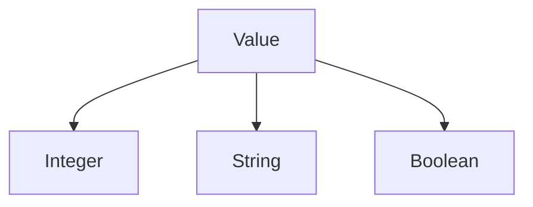

#### Berechnung
Eine Berechnung besteht aus der Operation (Multiplikation, Division, Addition oder Subtraktion) und den Operanden, welche jeweils Ausdrücke sind
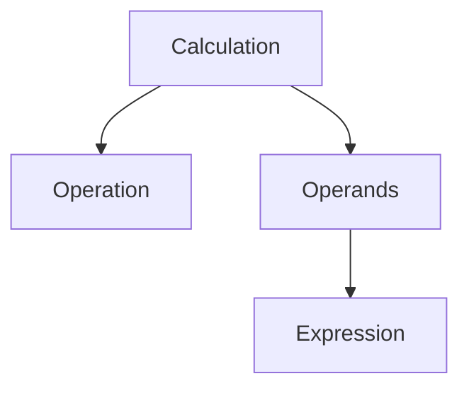

#### Vergleich
Ein Vergleich besteht aus der Vergleichsoperation (Gleich, Ungleich, Größer gleich, Kleiner gleich, Größer als, Kleiner als) und den Operanden, welche jeweils Ausdrücke sind
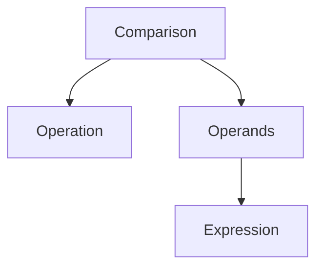

#### Bool'sche Negation
Eine bool'sche Negation besteht aus dem zu negierenden Ausdruck
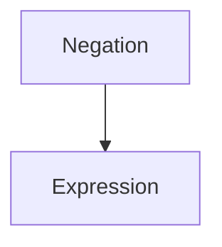

#### Bool'sche Verknüpfung
Eine bool'sche Negation besteht aus aus der Verknüpfungsoperation (Und, Oder) und den Operanden, welche jeweils Ausdrücke sind
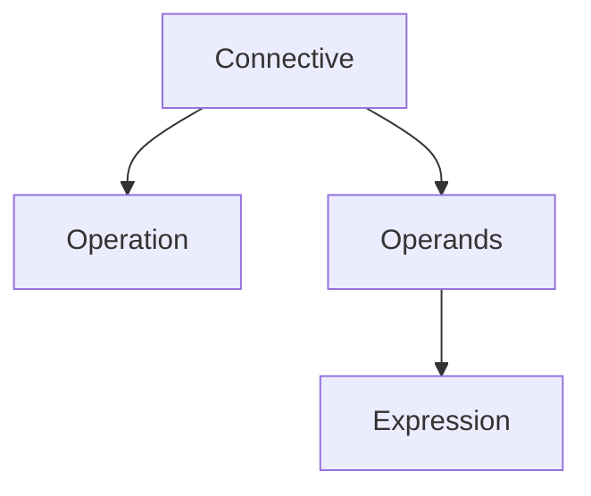

## Zuweisung
Eine Zuweisung besteht aus dem Namen der zuzuweisenden Variable und dem Wert, welcher ein Ausdruck ist
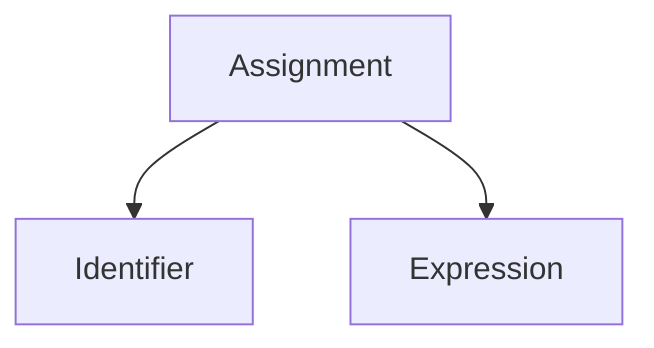

## Schleife
Eine Schleife besteht aus einer Bedingung, welche ein Ausdruck ist, und den Schleifenkörper, welche eine Liste beliebig vieler Statements ist
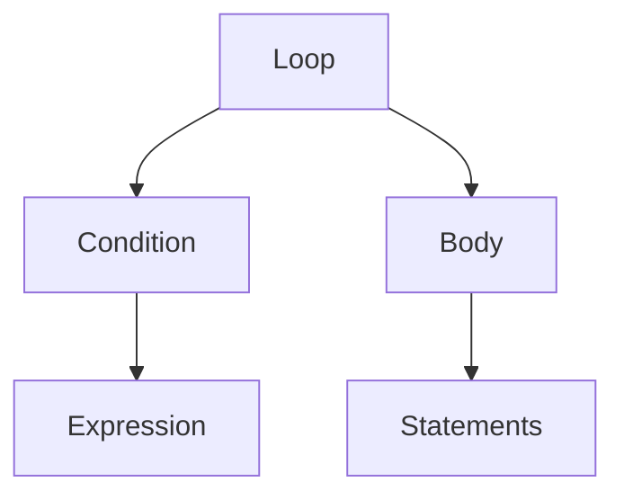

## Bedingte Anwesiung
Eine bedingte Anweisung besthet aus einer Bedingung, welche ein Ausdruck ist, dem zutreffenden Körper und optional dem nicht zutreffenden Körper, welche jeweils aus einer Liste beliebig vieler Statements bestehen
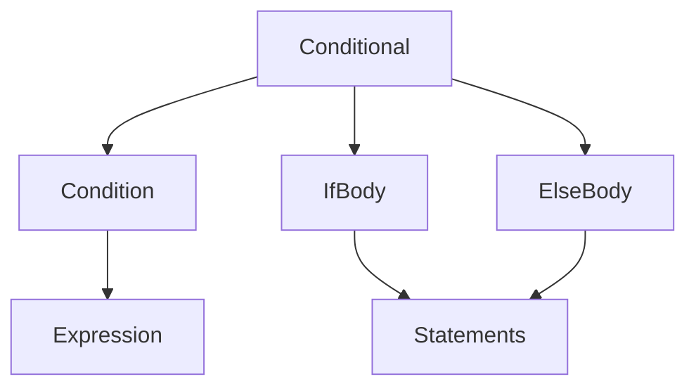

## Funktionsdefinition
Eine Funktionsdefinition besteht aus dem Namen der Funktion, einer Liste von Funktionsparameter und dem Funktionskörper
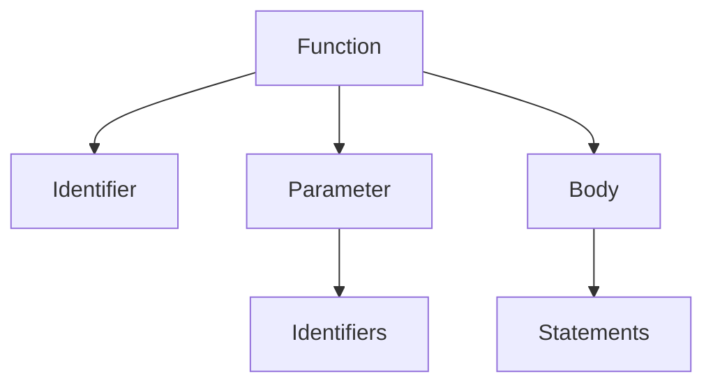

## Rückgabeanweisung
Eine Rückgabeanweisung besteht aus dem zurückzugebenden Ausdruck
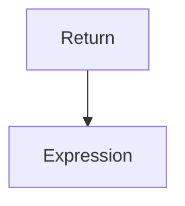

## Klassendefinition
Eine Klassendefinition besteht aus dem Namen der Klasse, optional dem Namen der Elternklasse und beliebig vieler Definitionen von Funktionen
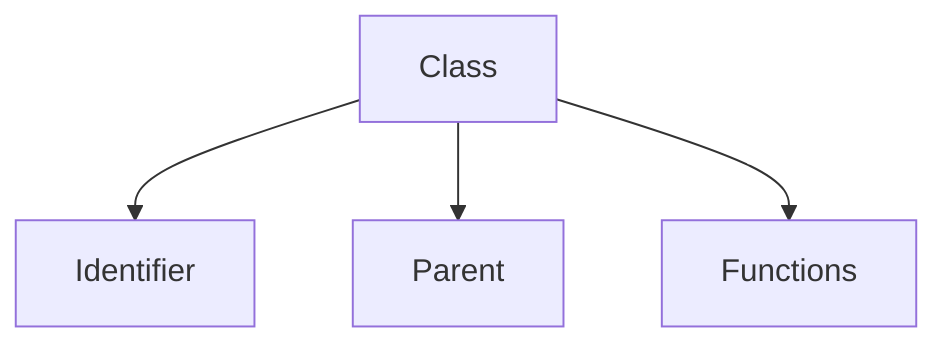
