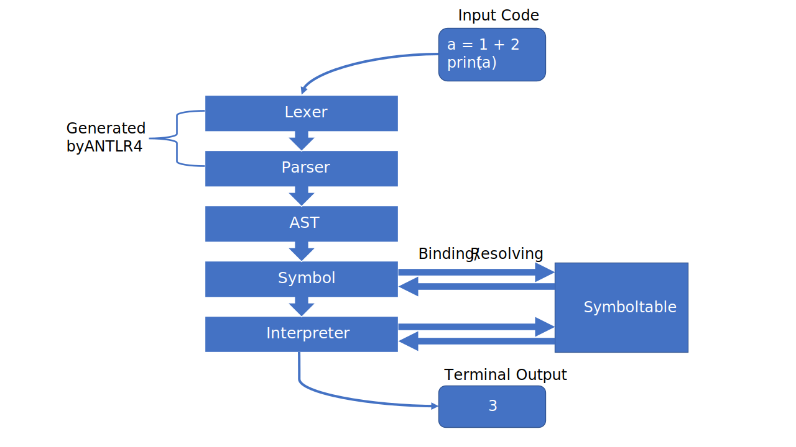

# Introduction

## Language

- python subset
- identation is not required
- blocks delimited by `#end`

## Features
Our programming language can do the following things

 - Basic arithmetic operation (+, -, /, *)
 - Comparison operation (==, !=, >=, <=, >, <)
 - Logical operation (And, Or, Not)
 - Loops (While)
 - Conditionals (if, elif, else)
 - BuiltIn Functions (Input, Print)
 - Variables (Dynamic/No types)
 - Functions
 - Recursion
 - **Classes with single inheritance**

# Syntax examples
## Loops
```python
a = 10
while (a >= 0):
    print(a)
    a = a - 1
#end
```

## Function with recursion
```python
def f(a):
  print(a)
  if a > 0:
    f(a - 1)
  #end
  print(a)
#end

f(10)
```

## Classes with inheritance
```python 
class A:
  def set_a(self, a):
    self.a = a
  #end

  def get_a(self, a):
    return self.a
  #end
#end

class B(A):
  def print_a(self):
    print(self.a)
  #end
#end

b = B()
b.set_a(3)
b.print_a()
```

# Compiling
{height=75%}

## Overview
{height=75%}

## Lexical analysis
Converting a sequence of characters from the source code into a sequence of tokens.

```antlrv4
/* ... */
DEF                : 'def';
CLASS              : 'class';
SELF               : 'self';
IDENTIFIER         : [a-zA-Z_] [a-zA-Z0-9_]* ;
END                : '#end' ('\n' | '\r\n')?;
WHITESPACE         : [ \t\r\n]+ -> skip ;
/* ... */
```
ANTLR generates a scanner from the given grammar for us so we can use the tokens in our syntactic analyses.

## Syntactic analysis
Arrange the tokens into a Parse Tree that represents the syntactic structure.

## Functions
This syntactic structure describes a definition of a function,
```antlrv4
function: DEF IDENTIFIER LBRACKET function_parameter RBRACKET COLON 
          statements END ;
```
so we are able to encapsulate instructions with the following code
```python
def functionA():
  print("I am function A")
#end
```

## Classes
We also want to define a class structure
```antlrv4
class_function: DEF IDENTIFIER LBRACKET SELF (COMMA function_parameter)? 
                RBRACKET COLON statements END;
class         : CLASS IDENTIFIER (COLON | LBRACKET IDENTIFIER RBRACKET COLON) 
                class_function* END;
```
and use it in our source code
```python
class B(A):
  def methodB(self):
      print("I am methodB from class B")
  #end
#end
```

# Abstract syntax tree
The AST is generated from the parse tree

## Function node
```{.mermaid width=300}
graph TD;
  Function-->Identifier;
  Function-->Parameter;
  Parameter-->Identifiers;
  Function-->Body;
  Body-->Statements;
```

## Class node
```{.mermaid width=300}
graph TD;
  Class-->Identifier;
  Class-->Parent;
  Class-->Functions;
```

# Symbol
Binds variables, functions and class names in the symbol table


During these steps, it already does some semantic analysis
for example, if functions or classes are defined more than once the compiler will throw an error

# Symbol table
The symbol table is separated into scopes each scope holds information about

 - List of symbols
   - Variables
   - Functions
   - Classes
   - BuiltIn Function (print, input) 
 - Parent scope (none if global scope)

Both the symbol visitor and interpreter have access to this symbol table

## Example
```{.mermaid width=500}
classDiagram
    BuiltInScope <|-- GlobalScope
    GlobalScope <|-- Function
    GlobalScope <|-- Class
    GlobalScope <|-- Scope
    Function <|-- FunctionScope
    Class <|-- ClassScope
    ClassFunction <|-- ClassFunctionScope
    ClassScope <|-- ClassFunction
    class GlobalScope {
        symbols [methodA, classA, a, b]
    }
    class BuiltInScope {
        symbols [print, input]
    }
    class Function{
    }
    class FunctionScope{
        symbols [parameter_a, parameter_b]
    }
    class Class{
    }
    class ClassScope{
        symbols [classMethodA]
    }
    class ClassFunction {
    
    }
    class ClassFunctionScope{
        symbols [parameter_a, parameter_b]
    }
    class Scope{
        symbols [a, b]
    }
```

# Interpreter
We can use the AST structure and the information in the symbol table to execute the code

## Instantiating classes
Classes must be instantiated by specifying for example ```a = A()```

The following steps are happening

 1. ```visit(Assignment node)``` gets called to assign a value to the variable ```a``` 
 2. Because ```A()``` has to be instantiated it calls ```visit(Call node)```
 3. The function checks if the symbol is a instance of Class (symbol) and calls the ```((Class) symbol).instantiate()``` method of that symbol
 4. ```instantiate()``` creates a new scope with a parent in the symbol table and returns it
 5. The newly created instance (scope) is then assigned to variable ```a```

---

```java
public class InterpretingVisitor extends AstVisitorBase<Object> {
    @Override
    public Object visit(Assignment node) {
        Symbol symbol;
        if(node.getIdentifier().getIdentifier().equals("self")) {
            // Handle self assignments
        } else {
            symbol = scope.resolve(node.getIdentifier());
            if (symbol instanceof Variable) {
                // Assign value to variable
                ((Variable) symbol).setValue(node.getExpression().accept(this));
            }
        }

        return null;
    }
```

---

```java
    @Override
    public Object visit(Call node) {
        /* ... */
        Symbol symbol = scope.resolve(node.getIdentifier());
        if (symbol instanceof org.compilerbau.minipython.symbol.Function) {
            // Handle function symbol
        } else if (symbol instanceof org.compilerbau.minipython.symbol.Class) {
            return ((Class) symbol).instantiate();
        } else if (symbol instanceof BuiltInFunction) {
            // Handle BuiltIin functions
        } else {
            throw new InterpreterException("Call error on " + node.getIdentifier());
        }
    }
    /* ... */
}
```

---

```java
public class Class extends Symbol implements Scoped {
    /* ... */
    public Instance instantiate() {
        Scope scope = new Scope();
        scope.setParent(this.scope);
        return new Instance(scope);
    }
}
```

## Binding symbols to instances
You may have noticed that during instantiating no symbols are bound to that newly created instance

The actual binding happens when a class function is called

```python
class A():
    def setA(self, a):
        self.a = a
    #end
    def getA(self):
        return self.a
    #end
#end
```

---

 1. By calling ```a.setA(10)``` it eventually lands in the ```visit(Assignment node)``` method because we try to assign a value ```self.a = a```
 2. Because the assignment starts with ```self``` it will first get the scope symbol of our newly created instance ```scope.resolve(node.getIdentifier().getIdentifier())```
 3. The scope symbol is cast to a class instance ```Class.Instance instance = (Class.Instance) ((Variable) symbol).getValue()```
 4. By doing ```node.getIdentifier().getNext()``` we get variable ```a``` after the ```self.``` and now we can try to resolve it **locally** (```if(instance.getScope().resolveLocally(var) == null)```)
 5. If the variable is not resolved we will simply bind it to this instance ```instance.getScope().bind(var, new Variable())```
 6. The last step would be to just assign the value to that variable ```((Variable) selfSymbol).setValue(node.getExpression().accept(this))```

---

```java
public Object visit(Assignment node) {
    if(node.getIdentifier().getIdentifier().equals("self")) {
        Symbol symbol = scope.resolve(node.getIdentifier().getIdentifier()); 
        String var = node.getIdentifier().getNext().getIdentifier();
        Class.Instance instance = (Class.Instance) ((Variable) symbol).getValue();    
        // Bind class variable to instance if not found
        if(instance.getScope().resolveLocally(var) == null) {
            instance.getScope().bind(var, new Variable());
        }        
        // Assign value to class variable
        Symbol selfSymbol = instance.getScope().resolveLocally(var);
        if(selfSymbol instanceof Variable) {
            ((Variable) selfSymbol).setValue(node.getExpression().accept(this));
        }
    } 
    /* ... */
}
```

---

Now, what if we called ```a.getA()``` before ```a.setA(10)``` the program would simply crash because ```self.a``` is not bound

To avoid that we will simply bind it in the ``` visit(Identifier node)``` method to the instance and ```return null```

```java
public Object visit(Identifier node) {
    Symbol symbol = scope.resolve(node);
    /* ... */
    if (symbol == null && node.getIdentifier().equals("self")) {
        // Bind class attribute if not found
        symbol = scope.resolve(node.getIdentifier());
        Class.Instance instance = (Class.Instance) ((Variable) symbol).getValue();
        instance.getScope().bind(node.getNext().getIdentifier(), new Variable());
        return null;
    }
    /* ... */ 
}
```

# Test Cases
## Parameter handling
```python
def setParam(b):
  b = 4
#end

# ...

a = 3
setParam(a)

# ...
```

# Perspective
The interpreter should give detailed information about the errors in the source code so the developer able to find them easier 
