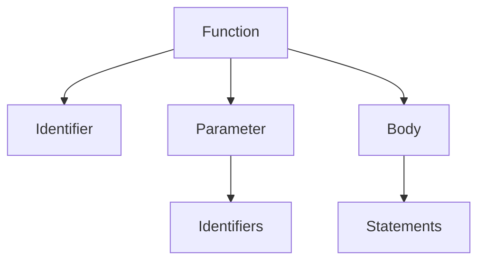
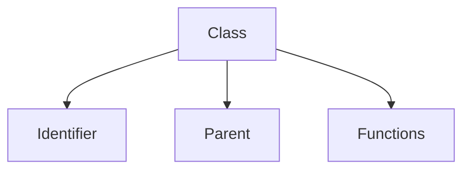

# Compiling


# Overview


# Lexical analysis
converting a sequence of characters from the source code into a sequence of tokens.
```
...
DEF                : 'def';
CLASS              : 'class';
SELF               : 'self';
IDENTIFIER         : [a-zA-Z_] [a-zA-Z0-9_]* ;
END                : '#end' ('\n' | '\r\n')?;
WHITESPACE         : [ \t\r\n]+ -> skip ;
...
```
ANTLR generate a scanner from the given grammar for us, so we can use the tokens in our syntactic analyses.

# Syntactic analysis
arrange the tokens into a Parse-Tree that represents the syntactic structure.

## Funktions
This syntactic structure describes a definition of a function,
```
function           : DEF IDENTIFIER LBRACKET function_parameter RBRACKET COLON statements END ;
```
so we are able to encapsulate instructions with the following code
```python
def functionA():
print("I am function A")
#end
```

## Classes
We also want to define a class structure
```
class_function     : DEF IDENTIFIER LBRACKET SELF (COMMA function_parameter)? RBRACKET COLON statements END;
class              : CLASS IDENTIFIER (COLON | LBRACKET IDENTIFIER RBRACKET COLON) class_function* END;
```
and use it in our sorce code
```python
class B(A):
def methodB(self):
    print("I am methodB from class B")
#end
#end
```
# Abstract syntax tree
## Funktion node


## Class node


# Symbol table
hold informations about the source code
* variables
* function names
* class names

# Interpreter
we can use the ast structure to visit the nodes. With the additional information in the symbol table we can resolve the elements and execute the code

# Test Cases
## Parameter handling
```python
def setParam(b):
b = 4
#end
...
a = 3
setParam(a)
...
```

# Perspective
The interpreter should give detailed information about the errors in the source code so the developer will be able to find them easier 
