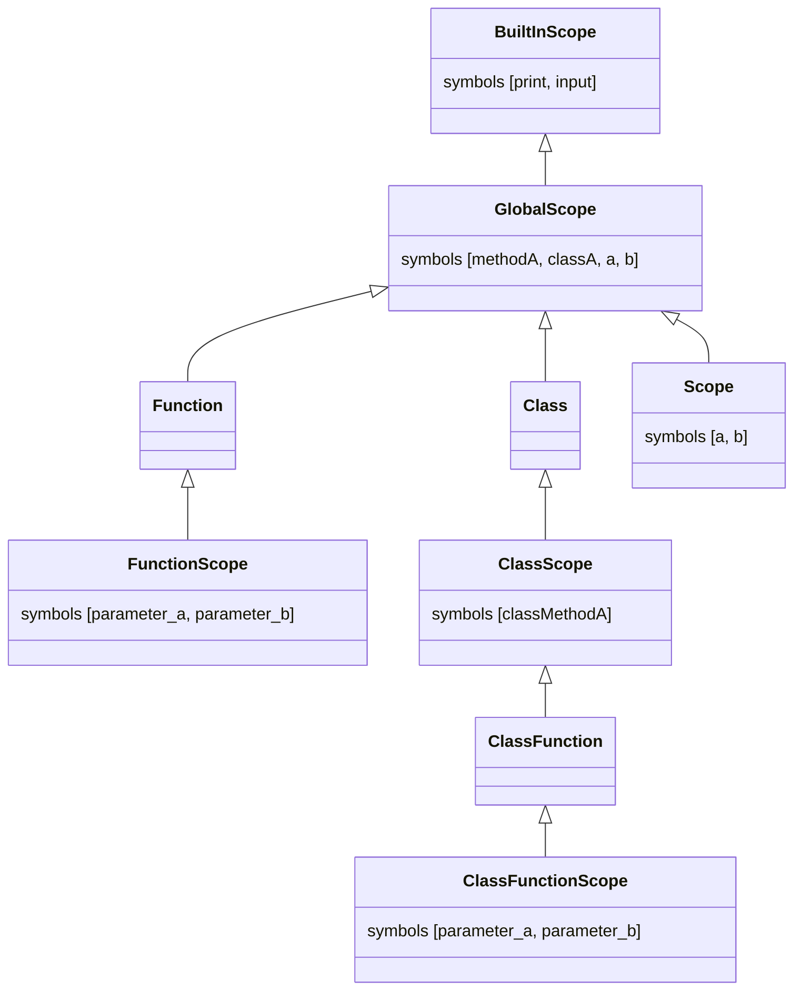

# Compiling


# Overview


# Lexical analysis
Converting a sequence of characters from the source code into a sequence of tokens.
```
...
DEF                : 'def';
CLASS              : 'class';
SELF               : 'self';
IDENTIFIER         : [a-zA-Z_] [a-zA-Z0-9_]* ;
END                : '#end' ('\n' | '\r\n')?;
WHITESPACE         : [ \t\r\n]+ -> skip ;
...
```
ANTLR generatse a scanner from the given grammar for us so we can use the tokens in our syntactic analyses.

# Syntactic analysis
Arrange the tokens into a Parse Tree that represents the syntactic structure.

## Funktions
This syntactic structure describes a definition of a function,
```
function           : DEF IDENTIFIER LBRACKET function_parameter RBRACKET COLON statements END ;
```
so we are able to encapsulate instructions with the following code
```python
def functionA():
print("I am function A")
#end
```

## Classes
We also want to define a class structure
```
class_function     : DEF IDENTIFIER LBRACKET SELF (COMMA function_parameter)? RBRACKET COLON statements END;
class              : CLASS IDENTIFIER (COLON | LBRACKET IDENTIFIER RBRACKET COLON) class_function* END;
```
and use it in our source code
```python
class B(A):
def methodB(self):
    print("I am methodB from class B")
#end
#end
```
# Abstract syntax tree
The AST is generated from the parse tree
## Function node


## Class node


# Symbol
Binds variables, functions and class names in the symbol table


During these steps, it already does some semantic analysis
for example, if functions or classes are defined more than once the compiler will throw an error

# Symbol table
The symbol table is separated into scopes each scope holds information about
* List of symbols
    * Variables
    * Functions
    * Classes
    * BuiltIn Function (print, input) 
* Parent scope (none if global scope)

Both the symbol visitor and interpreter have access to this symbol table

## Example


# Interpreter
We can use the AST structure and the information in the symbol table to execute the code
## Instantiating classes
Classes must be instantiated by specifying for example ```a = A()```

The following steps are happening
1. ```visit(Assignment node)``` gets called to assign a value to the variable ```a``` 
2. Because ```A()``` has to be instantiated it calls ```visit(Call node)```
3. The function checks if the symbol is a instance of Class (symbol) and calls the
```((Class) symbol).instantiate()``` method of that symbol
4. ```instantiate()``` creates a new scope with a parent in the symbol table and returns it
5. The newly created instance (scope) is then assigned to variable ```a```

```java
public class InterpretingVisitor extends AstVisitorBase<Object> {
    ...
    @Override
    public Object visit(Assignment node) {
        super.visit(node);

        Symbol symbol;
        if(node.getIdentifier().getIdentifier().equals("self")) {
            // Handle self assignments
        } else {
            symbol = scope.resolve(node.getIdentifier());
            if (symbol instanceof Variable) {
                // Assign value to variable
                ((Variable) symbol).setValue(node.getExpression().accept(this));
            }
        }

        return null;
    }
    
    @Override
    public Object visit(Call node) {
        ...
        Symbol symbol = scope.resolve(node.getIdentifier());
        if (symbol instanceof org.compilerbau.minipython.symbol.Function) {
            // Handle function symbol
        } else if (symbol instanceof org.compilerbau.minipython.symbol.Class) {
            return ((Class) symbol).instantiate();
        } else if (symbol instanceof BuiltInFunction) {
            // Handle BuiltIin functions
        } else {
            throw new InterpreterException("Call error on " + node.getIdentifier());
        }
    }
    ...
}

public class Class extends Symbol implements Scoped {
    ...
    public Instance instantiate() {
        Scope scope = new Scope();
        scope.setParent(this.scope);
        return new Instance(scope);
    }
}
```

## Binding symbols to instances
You may have noticed that during instantiating no symbols are bound to that newly created instance

The actual binding happens when a class function is called
1. By calling ```a.setA(10)``` it eventually lands in the ```visit(Assignment node)``` method because we try to assign a value ```self.a = a```
2. Because the assignment starts with ```self``` it will first get the scope symbol of our newly created instance ```scope.resolve(node.getIdentifier().getIdentifier())```
3. The scope symbol is cast to a class instance ```Class.Instance instance = (Class.Instance) ((Variable) symbol).getValue()```
4. By doing ```node.getIdentifier().getNext()``` we get variable ```a``` after the ```self.``` and now we can try to resolve it **locally** (```if(instance.getScope().resolveLocally(var) == null)```)
5. If the variable is not resolved we will simply bind it to this instance ```instance.getScope().bind(var, new Variable())```
6. The last step would be to just assign the value to that variable ```((Variable) selfSymbol).setValue(node.getExpression().accept(this))```

Now, what if we called ```a.getA()``` before ```a.setA(10)``` the program would simply crash because ```self.a``` is not bound

To avoid that we will simply bind it in the ``` visit(Identifier node)``` method to the instance and ```return null```

```python
class A():
    def setA(self, a):
        self.a = a
    #end
    def getA(self):
        return self.a
    #end
#end
```

```java
public class InterpretingVisitor extends AstVisitorBase<Object> {
    ...
    @Override
    public Object visit(Assignment node) {
        ...
        Symbol symbol;
        if(node.getIdentifier().getIdentifier().equals("self")) {
            if(node.getIdentifier().getNext() == null) {
                throw new InterpreterException("Can't assign values directly to self");
            }
            // Resolve instance symbol
            symbol = scope.resolve(node.getIdentifier().getIdentifier());
            // Get variable name
            String var = node.getIdentifier().getNext().getIdentifier();
            // Get instance and cast it
            Class.Instance instance = (Class.Instance) ((Variable) symbol).getValue();
            // Bind class variable to instance if not found
            if(instance.getScope().resolveLocally(var) == null) {
                instance.getScope().bind(var, new Variable());
            }
            // Assign value to class variable
            Symbol selfSymbol = instance.getScope().resolveLocally(var);
            if(selfSymbol instanceof Variable) {
                ((Variable) selfSymbol).setValue(node.getExpression().accept(this));
            }
        } else {
        // Handle normal assignment
    }
    
    @Override
    public Object visit(Identifier node) {
        Symbol symbol = scope.resolve(node);

        if (symbol instanceof Variable) {
            return ((Variable) symbol).getValue();
        } else if (symbol == null && node.getIdentifier().equals("self")) {
            // Bind class attribute if not found
            symbol = scope.resolve(node.getIdentifier());
            Class.Instance instance = (Class.Instance) ((Variable) symbol).getValue();
            instance.getScope().bind(node.getNext().getIdentifier(), new Variable());

            return null;
        } else if (symbol == null) {
            throw new InterpreterException(node.getIdentifier() + " doesn't exist");
        } else {
            throw new InterpreterException(node.getIdentifier() + " is not a variable");
        }
    }
    ...
}
```

# Test Cases
## Parameter handling
```python
def setParam(b):
b = 4
#end
...
a = 3
setParam(a)
...
```

# Perspective
The interpreter should give detailed information about the errors in the source code so the developer able to find them easier 
